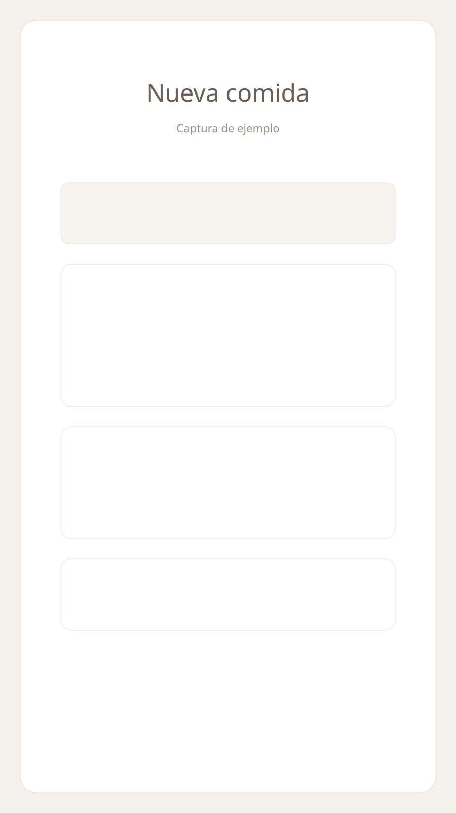
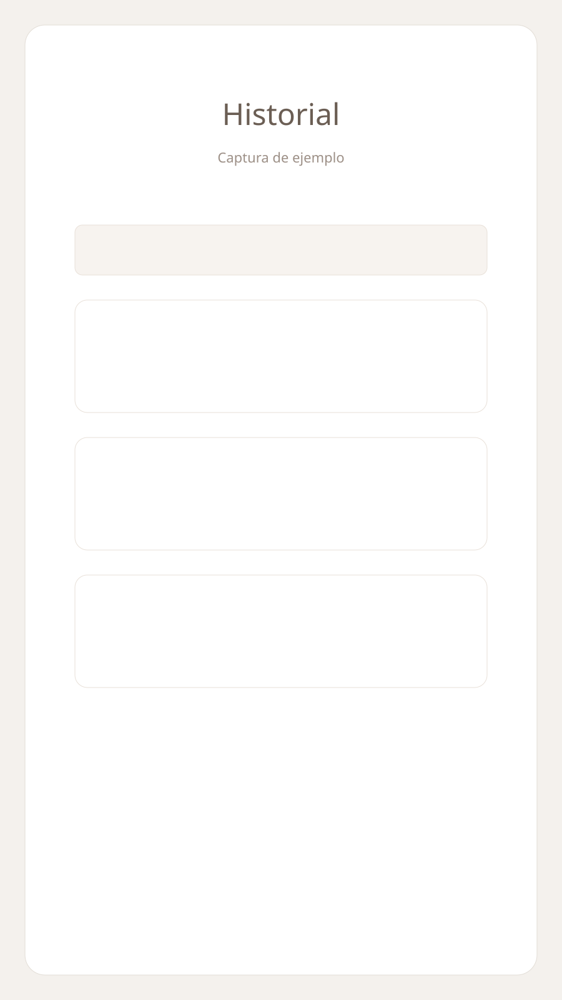
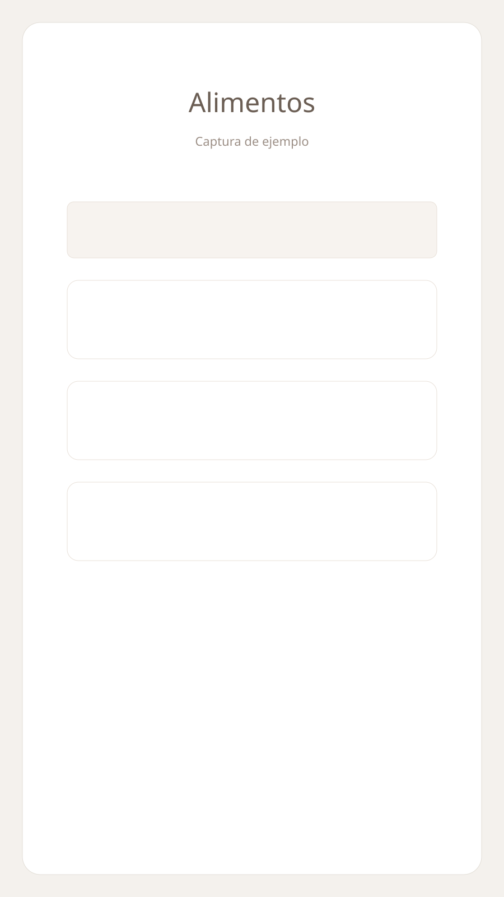
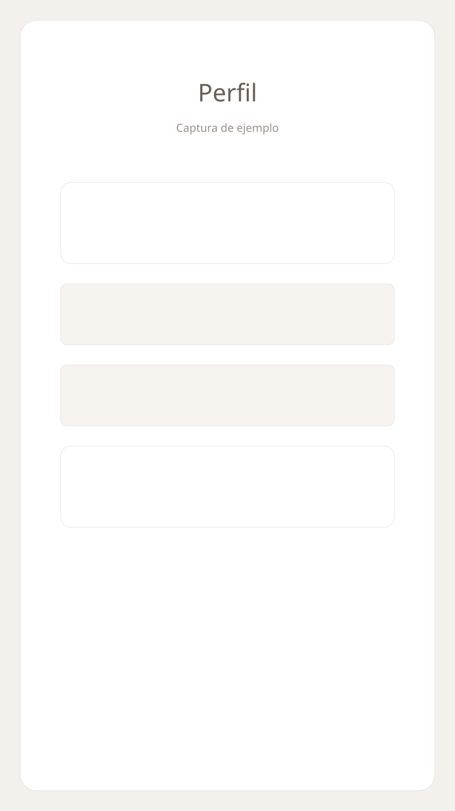

# Calculadora de Diabetes (DiabetesCalculator)

Aplicación Android para el cálculo de hidratos, raciones e insulina rápida, con historial, biblioteca de alimentos y soporte para Nightscout. Esta app es una ayuda y no sustituye el consejo médico profesional.

**Estado:** uso personal / en desarrollo activo.

**Compatibilidad:** Android 8.0+ (`minSdk 26`), `targetSdk 34`.

**Stack:** Kotlin, Jetpack Compose + Material 3, Room, WorkManager, Retrofit, Kotlinx Serialization.

## Capturas de pantalla

> Nota: las imágenes son marcadores de posición. Sustitúyelas por capturas reales en `docs/screenshots/` manteniendo los mismos nombres de archivo.

| Nueva comida | Historial |
|---|---|
|  |  |

| Alimentos | Perfil |
|---|---|
|  |  |

## Funcionalidades clave

- Cálculo de hidratos totales, raciones e insulina sugerida en tiempo real.
- Comidas con múltiples alimentos y notas.
- Historial agrupado por día con colapsado/expandido y filtros por rango.
- Biblioteca de alimentos con búsqueda, edición y eliminación.
- Integración con Nightscout para glucosa actual y registro de glucosa previa a la comida.
- Registro automático de glucosa a las 2 horas (si Nightscout está configurado).
- Copias de seguridad manuales (exportar/importar) y automáticas diarias cifradas.
- Importación de la última copia automática desde la pantalla de perfil.

## Flujo de uso rápido

1. Configura tu perfil (gramos por ración, ratio insulina/ración y, opcionalmente, Nightscout).
2. Crea una nueva comida, selecciona alimentos y gramos.
3. Revisa el resumen (hidratos, raciones, insulina) y guarda el registro.
4. Consulta el historial, añade notas y revisa glucosa antes/después.

## Arquitectura

- **UI (Compose):** pantallas en `app/src/main/java/com/diabetes/calculator/ui/screens/`.
- **Datos (Room):** entidades y DAO en `app/src/main/java/com/diabetes/calculator/data/`.
- **Dominio:** cálculos en `app/src/main/java/com/diabetes/calculator/domain/`.
- **Workers:** tareas programadas en `app/src/main/java/com/diabetes/calculator/work/`.
- **Utilidades:** fechas, copias de seguridad y seguridad en `app/src/main/java/com/diabetes/calculator/util/`.

## Modelos principales

- `UsuarioProfile`: nombre, gramos por ración, ratio insulina/ración y Nightscout.
- `Alimento`: nombre, hidratos por 100 g, fuente y nota.
- `RegistroComida`: hidratos totales, raciones, insulina, fecha, glucosa antes y después.
- `AlimentoEnRegistro`: relación alimento-registro con gramos consumidos.

## Nightscout

- Configura URL y token (opcional) en **Perfil**.
- Se muestra la glucosa actual en la barra superior.
- Al guardar una comida se registra la glucosa previa si Nightscout está activo.
- Se programa un worker para consultar la glucosa a las 2 horas.

## Copias de seguridad

- **Manual:** exportar/importar desde Perfil.
- **Automática:** WorkManager diario. Se conservan las últimas 7 copias.
- **Ubicación:** `Android/data/com.diabetes.calculator/files/backups/` (o almacenamiento interno si no hay externo).
- **Cifrado:** AES-GCM con contraseña almacenada de forma segura (`EncryptedSharedPreferences`).
- **Importar última copia:** botón dedicado en Perfil con fecha de la última copia.

## Seguridad y privacidad

- El token de Nightscout se guarda en almacenamiento cifrado.
- Las copias se exportan cifradas y no exponen el token por defecto.
- Los datos se mantienen localmente en Room.

## Datos iniciales

- `alimentos_librito.csv` se usa como semilla para la base de datos de alimentos.
- La app actualiza o inserta alimentos de forma idempotente.

## Construcción y ejecución

Requisitos:

- Android Studio (Iguana o superior recomendado).
- JDK 17.
- Android SDK 34.

Comandos útiles:

- `./gradlew assembleDebug`
- `./gradlew :app:compileDebugKotlin`

## Estructura del proyecto (resumen)

- `app/src/main/java/com/diabetes/calculator/`
- `app/src/main/java/com/diabetes/calculator/ui/`
- `app/src/main/java/com/diabetes/calculator/data/`
- `app/src/main/java/com/diabetes/calculator/work/`
- `alimentos_librito.csv`
- `docs/screenshots/`

## Hoja de ruta (ideas)

- Exportar copias a Drive/iCloud.
- Filtros avanzados en historial.
- Exportación a CSV.

## Licencia

No hay una licencia definida todavía. Añade la licencia adecuada según el uso previsto.
