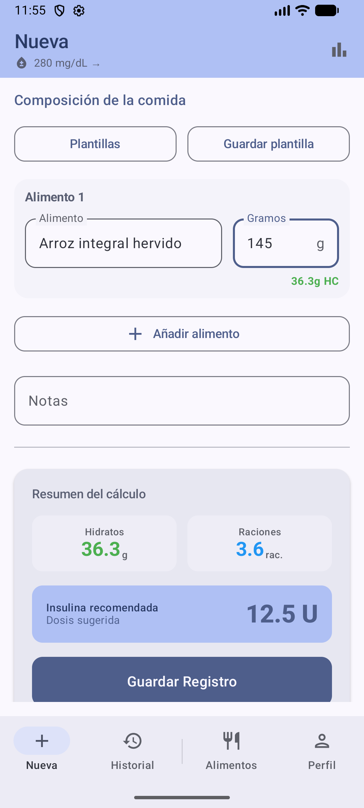
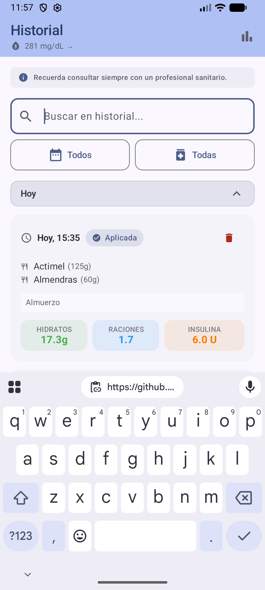
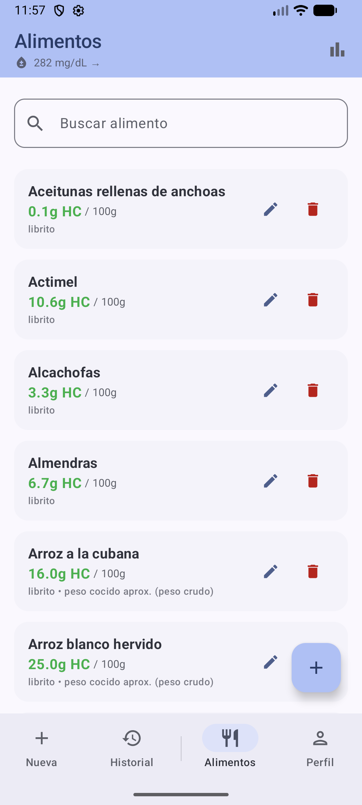
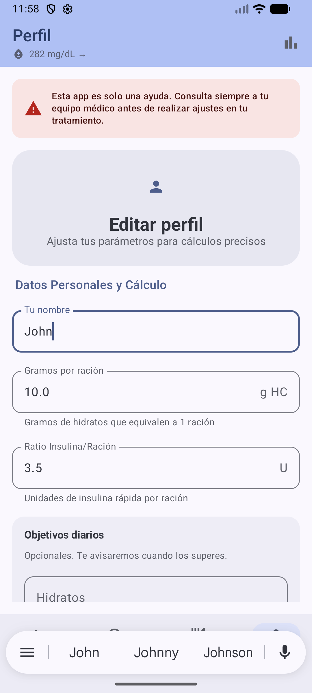

# Calculadora de Diabetes (DiabetesCalculator)

Aplicación Android para el cálculo de hidratos, raciones e insulina rápida, con historial, biblioteca de alimentos y soporte para Nightscout. Esta app es una ayuda y no sustituye el consejo médico profesional.

**Estado:** uso personal / en desarrollo activo.

**Compatibilidad:** Android 8.0+ (`minSdk 26`), `targetSdk 34`.

**Stack:** Kotlin, Jetpack Compose + Material 3, Room, WorkManager, Retrofit, Kotlinx Serialization.

## Capturas de pantalla

| Nueva comida | Historial |
|---|---|
|  |  |

| Alimentos | Perfil |
|---|---|
|  |  |

## Funcionalidades clave

- Cálculo de hidratos totales, raciones e insulina sugerida en tiempo real.
- Comidas con múltiples alimentos y notas.
- Historial agrupado por día con colapsado/expandido y filtros por rango.
- Biblioteca de alimentos con búsqueda, edición y eliminación.
- Integración con Nightscout para glucosa actual, tendencia y registro de glucosa previa a la comida.
- Cálculo con Nightscout autoritativo: si hay dato remoto (glucosa/tendencia/insulina), ese dato manda.
- Ajuste automático de corrección por tendencia CGM (flecha Nightscout) en modo con corrección.
- Fallback manual de glucosa cuando no hay lectura Nightscout reciente.
- IOB híbrida: prioridad Nightscout + dosis locales aplicadas provisionales hasta que llegue el remoto.
- Integración LibreView no oficial (enfoque Juggluco-like) con credenciales cifradas y región auto + override.
- Subida a LibreView con política clínica: comidas suben solo hidratos, insulina solo desde registros NFC NovoPen.
- Idempotencia estricta en LibreView: no resubir si ya está enlazado y sin cambios, edición sobre el mismo ID y delete lógico.
- Registro automático de glucosa a las 2 horas (si Nightscout está configurado).
- Copias de seguridad manuales (exportar/importar) y automáticas diarias cifradas.
- Importación de la última copia automática desde la pantalla de perfil.

## Flujo de uso rápido

1. Configura tu perfil (gramos por ración, ratio insulina/ración y, opcionalmente, Nightscout).
2. Crea una nueva comida, selecciona alimentos y gramos.
3. Revisa el resumen (hidratos, raciones, insulina) y guarda el registro.
4. Consulta el historial, añade notas y revisa glucosa antes/después.

## Arquitectura

- **UI (Compose):** pantallas en `app/src/main/java/com/diabetes/calculator/ui/screens/`.
- **Datos (Room):** entidades y DAO en `app/src/main/java/com/diabetes/calculator/data/`.
- **Dominio:** cálculos en `app/src/main/java/com/diabetes/calculator/domain/`.
- **Workers:** tareas programadas en `app/src/main/java/com/diabetes/calculator/work/`.
- **Utilidades:** fechas, copias de seguridad y seguridad en `app/src/main/java/com/diabetes/calculator/util/`.

## Modelos principales

- `UsuarioProfile`: nombre, gramos por ración, ratio insulina/ración, Nightscout y configuración de LibreView.
- `Alimento`: nombre, hidratos por 100 g, fuente y nota.
- `RegistroComida`: hidratos totales, raciones, insulina, fecha, glucosa antes/después y enlaces de sync remoto.
- `AlimentoEnRegistro`: relación alimento-registro con gramos consumidos.

## Nightscout

- Configura URL y token (opcional) en **Perfil**.
- Se muestra la glucosa actual en la barra superior.
- Al guardar una comida, si hay lectura fresca de Nightscout, esa glucosa se usa como referencia principal.
- Si no hay lectura fresca, puedes introducir glucosa manual (fallback) para continuar el cálculo.
- La corrección por glucosa aplica ajuste por tendencia (`direction`) cuando la lectura usada es Nightscout.
- En conflictos de datos para IOB, Nightscout tiene prioridad; una dosis local aplicada cuenta de forma provisional hasta sincronizar.
- Se programa un worker para consultar la glucosa a las 2 horas.

## LibreView (integración no oficial)

- Activación y configuración en **Perfil**.
- Credenciales por `email/password` en almacenamiento cifrado (no se persisten en Room).
- Región con autodetección por `Locale` y opción de override manual (código ISO de 2 letras).
- Compatibilidad inicial orientada a LibreLink 2.
- Alcance de subida:
  - Comidas locales: solo hidratos (`foodEntries`).
  - Dosis: solo si vienen de NFC NovoPen (`insulinEntries`).
  - Una nueva comida no sube dosis de insulina.
- Ciclo completo remoto: `UPSERT` al crear/editar y `DELETE` lógico al borrar localmente.
- Idempotencia/enlace:
  - Si ya está enlazado con mismo hash, no se reenvía payload.
  - Se reutiliza `recordNumber` determinista por canal.
  - Si ya existe un evento propio de la app, se enlaza sin duplicar.
  - Tolerancias de enlace local: `±2 min`, `±0.2 U` insulina, `±1 g` hidratos.
- Backfill inicial de 30 días al activar por primera vez (una sola vez).
- Esta integración es no oficial y puede romperse por cambios del servicio remoto.

## Transparencia del cálculo

- La pantalla **Nueva comida** muestra la fuente de glucosa usada (`Nightscout` o `Manual fallback`).
- Si la fuente es Nightscout, muestra flecha de tendencia, antigüedad de lectura y glucosa proyectada.
- También se muestra el ajuste en unidades aplicado por tendencia, además del ajuste por insulina activa.
- El redondeo de dosis se realiza una sola vez al final del cálculo (pasos de 0.5 U).

## Informe IA (Google Gemini)

- En **Estadísticas** hay un icono de IA (brillo) en el `TopAppBar` para generar un informe con los datos del periodo seleccionado.
- La app usa **Firebase AI Logic** para invocar Gemini con mínima interacción de usuario (sin login obligatorio).

Configuración local recomendada:

1. Crea un proyecto en Firebase y añade la app Android con paquete `com.diabetes.calculator`.
2. Descarga `google-services.json` y colócalo en `app/google-services.json`.
3. En Firebase AI Logic, configura backend de Gemini para tu proyecto.
4. (Opcional) Define modelo por defecto en `local.properties`:

```properties
GEMINI_MODEL=gemini-2.5-flash
```

5. Alternativamente, define `GEMINI_MODEL` como variable de entorno.
6. Si no defines `GEMINI_MODEL`, se usa `gemini-2.5-flash`.

Notas:

- `local.properties` está en `.gitignore`.
- En `release` se usa App Check con Play Integrity; en `debug` se usa Debug App Check.

## Copias de seguridad

- **Manual:** exportar/importar desde Perfil.
- **Automática:** WorkManager diario. Se conservan las últimas 7 copias.
- **Ubicación:** `Android/data/com.diabetes.calculator/files/backups/` (o almacenamiento interno si no hay externo).
- **Cifrado:** AES-GCM con contraseña almacenada de forma segura (`EncryptedSharedPreferences`).
- **Importar última copia:** botón dedicado en Perfil con fecha de la última copia.

## Seguridad y privacidad

- El token de Nightscout se guarda en almacenamiento cifrado.
- Las credenciales/sesión de LibreView se guardan en almacenamiento cifrado.
- Las copias se exportan cifradas y no exponen el token por defecto.
- Los datos se mantienen localmente en Room.

## Datos iniciales

- `alimentos_librito.csv` se incluye como referencia/fuente del dataset.
- La semilla Android actual se carga desde código en `populateDatabase()` para mantener inserciones idempotentes.
- La app actualiza o inserta alimentos de forma idempotente.

## Construcción y ejecución

Requisitos:

- Android Studio (Iguana o superior recomendado).
- JDK 17 (recomendado para build/lint).
- Android SDK 34.

Comandos útiles:

- `./gradlew assembleDebug`
- `./gradlew :app:compileDebugKotlin`
- `./gradlew testDebugUnitTest`
- `./gradlew lintDebug` (ejecutar con JDK 17)

## Estructura del proyecto (resumen)

- `app/src/main/java/com/diabetes/calculator/`
- `app/src/main/java/com/diabetes/calculator/ui/`
- `app/src/main/java/com/diabetes/calculator/data/`
- `app/src/main/java/com/diabetes/calculator/work/`
- `alimentos_librito.csv`
- `docs/screenshots/`

## Hoja de ruta (ideas)

- Exportar copias a Drive/iCloud.
- Filtros avanzados en historial.
- Exportación a CSV.

## Licencia

MIT
